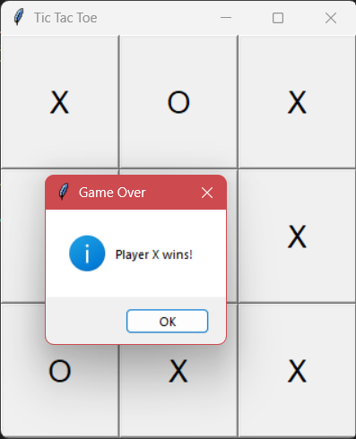
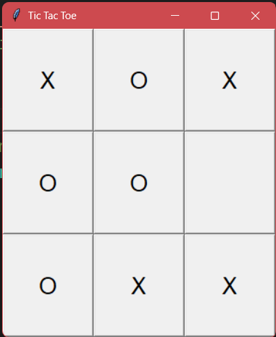

# 🎮 Tic Tac Toe (GUI Edition) – A Fun MVC Project! 🚀

Welcome to the **Tic Tac Toe** game built using Python and the **Model-View-Controller (MVC)** architecture with a beautiful **Tkinter GUI**! 🖥️✨  
This project is not just about playing the classic game — it's also a great example of how to structure your code using the **MVC design pattern**, making it clean, modular, and scalable. 🧱🛠️


## 🧠 What’s Inside?

This project separates concerns into three distinct parts following the **MVC pattern**:

| Component | Responsibility |
|----------|----------------|
| **Model** (`model/game_model.py`) | Manages the game logic and board state. |
| **View** (`view/game_view.py`) | Handles the graphical user interface using Tkinter. |
| **Controller** (`controller/game_controller.py`) | Coordinates between Model and View based on user input. |

And of course, we have a shiny new `main.py` that kicks off the whole experience! 🚪🎮


## 📦 Features

✅ Play Tic Tac Toe in a graphical window  
✅ Click buttons to make moves instead of typing numbers  
✅ Automatic win/draw detection  
✅ Reset button functionality  
✅ Clean separation of concerns using MVC  
✅ Modular and maintainable code structure  


## 🛠 How to Run

### Step-by-step guide:

1. 🔽 Clone this repository:
   ```bash
   git clone https://github.com/onyxwizard/tic-tac-toe-mvc.git
   ```

2. 📁 Navigate to the project folder:
   ```bash
   cd tic-tac-toe-mvc
   ```

3. ⚡ Run the game:
   ```bash
   python main.py
   ```

4. 🎯 Enjoy playing with your mouse! Just click the buttons to place your X or O.


## 📂 File Structure

```
tic-tac-toe-mvc/
│
├── main.py                     # Entry point 🚪
│
├── controller/
│   └── game_controller.py    # The brain that connects model & view 🧠
│
├── model/
│   └── game_model.py         # Game logic and board management 🧩
│
└── view/
    └── game_view.py          # Graphical interface using Tkinter 🎨
```


## 🤝 Why This Project Rocks

- 🌟 Great for learning **MVC architecture**
- 💡 Shows how to build a **GUI app in Python** using Tkinter
- 🧼 Encourages **clean code practices**
- 📈 Easy to extend: Add features like AI, score tracking, themes, etc.
- 🧑‍🏫 Perfect for beginners and intermediates alike!


## 📸 Preview

screenshot of the GUI, included! 👇  
Example:

 


## 🙋 Want to Contribute?

Feel free to fork this repo and open pull requests!  
Whether it's adding new features, improving UI, or fixing bugs — every contribution counts! 🙌


## 📬 Feedback?

Found an issue? Want to suggest something cool? Open an issue or DM me!  
Let’s keep building awesome stuff together! 💻💬


## 📜 License

MIT License – feel free to use this in your projects, tutorials, or anything else!  
Just give credit where it’s due. 😊


## 🏁 Final Thoughts

This Tic Tac Toe game is more than just a fun project — it’s a solid example of how to write **modular**, **maintainable**, and **extendable** Python applications using **Tkinter** and the **MVC pattern**. 🎯

Now go ahead and play some games — and maybe even add a little twist of your own! 🎉🎨


Happy coding! 💻✨  
Made with ❤️ by [Onyx](https://www.github.com/onyxwizard) 🧑‍💻